# Insomniac API

> A GitHub Actions-based automated solution to prevent API hibernation by sending periodic health checks during business hours.

## 🎯 Quick Overview

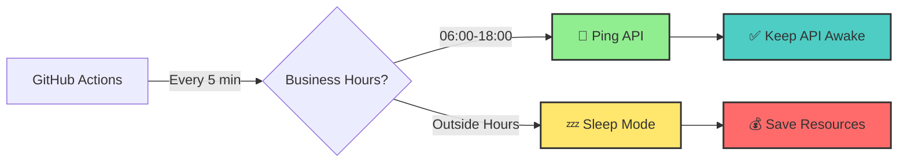

## 📋 Overview

Insomniac API is an automated bot designed to prevent your API from entering hibernation mode by sending periodic health check requests. The system operates exclusively during business hours (06:00-18:00, Monday-Saturday) to ensure optimal resource utilization while maintaining API availability.

## 🎯 Key Features

- ⏰ **Scheduled Automation**: Automated requests every 5 minutes during business hours
- 🕐 **Business Hours Only**: Active only from 06:00 to 18:00 (America/Manaus timezone)
- 📅 **Smart Scheduling**: Runs Monday through Saturday, excluding Sundays
- 🔍 **HTTP Monitoring**: Tracks and logs HTTP response codes
- 📊 **Execution Logging**: Comprehensive logging of all workflow executions
- 🎮 **Manual Execution**: Support for manual workflow triggers for testing and debugging
- 💰 **Resource Efficient**: Inactive outside business hours to minimize resource consumption

## 🏗️ Architecture

### System Overview

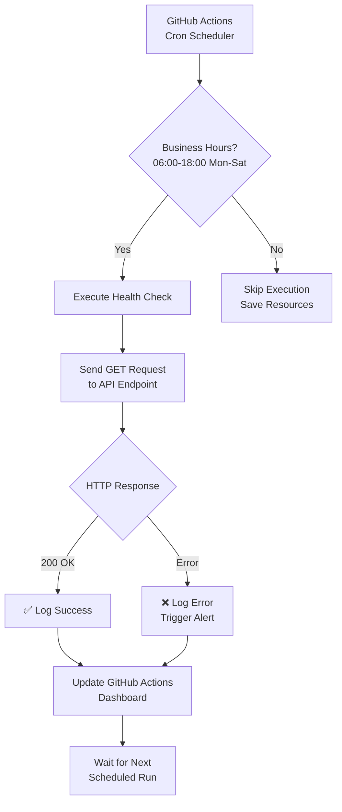

### Schedule Visualization

```mermaid
gantt
    title Insomniac API - Weekly Schedule
    dateFormat HH:mm
    axisFormat %H:%M
    section Monday
    Active Period    :active, 2024-01-01 06:00, 12h
    Inactive Period  :inactive, 2024-01-01 18:00, 12h
    section Tuesday
    Active Period    :active, 2024-01-02 06:00, 12h
    Inactive Period  :inactive, 2024-01-02 18:00, 12h
    section Wednesday
    Active Period    :active, 2024-01-03 06:00, 12h
    Inactive Period  :inactive, 2024-01-03 18:00, 12h
    section Thursday
    Active Period    :active, 2024-01-04 06:00, 12h
    Inactive Period  :inactive, 2024-01-04 18:00, 12h
    section Friday
    Active Period    :active, 2024-01-05 06:00, 12h
    Inactive Period  :inactive, 2024-01-05 18:00, 12h
    section Saturday
    Active Period    :active, 2024-01-06 06:00, 12h
    Inactive Period  :inactive, 2024-01-06 18:00, 12h
    section Sunday
    Inactive All Day :inactive, 2024-01-07 00:00, 24h
```

### Workflow Process

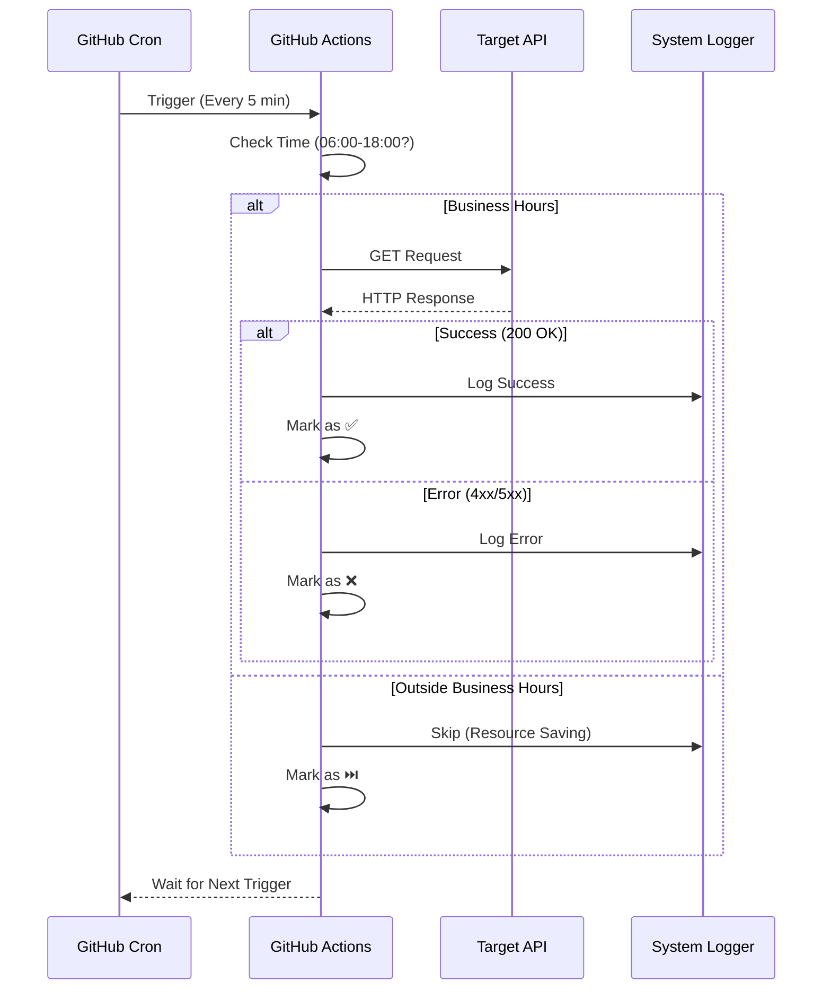

The project leverages **GitHub Actions** to automate the API health check process. The workflow is configured with the following schedule:

| Parameter | Value |
|-----------|-------|
| **Days** | Monday - Saturday |
| **Time Window** | 06:00 - 18:00 (America/Manaus) |
| **Frequency** | Every 5 minutes |
| **Timezone** | America/Manaus |

## 🔧 Configuration

### Monitored API

- **Endpoint**: `https://my-api.example.com/`
- **Expected Response**: HTTP 200 OK
- **Method**: GET

### Workflow Configuration

The GitHub Actions workflow is configured using cron expressions to execute during business hours only. The schedule automatically excludes:

- Outside business hours (18:00-06:00)
- Sundays
- Failed API responses trigger alerts

## 📈 Monitoring & Logging

### Dashboard Overview

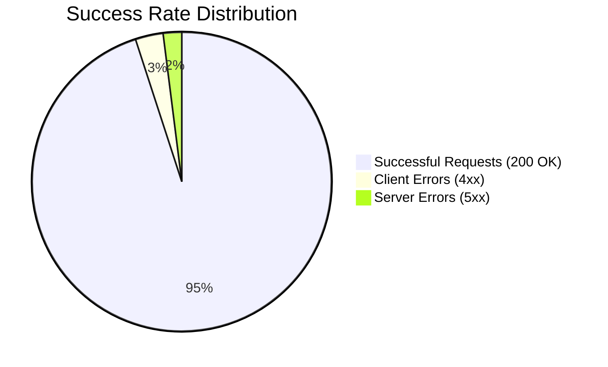

### Response Time Analysis

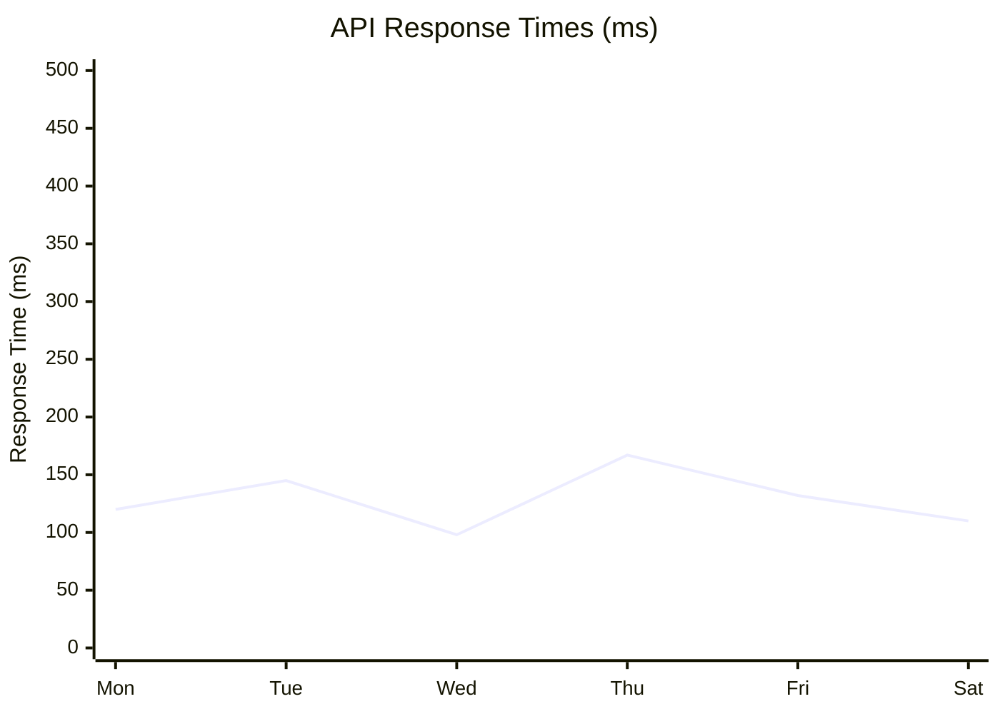

### GitHub Actions Dashboard

Monitor all workflow executions through the **Actions** tab in your GitHub repository. Each execution provides:

- ⏱️ Execution timestamp
- 🔢 HTTP response code
- ✅ Success/Failure status
- 📝 Detailed execution logs

### Response Status Tracking

The system tracks and categorizes API responses:

- **200 OK**: API is healthy and responsive
- **4xx/5xx Errors**: API issues requiring attention
- **Timeout**: API not responding within expected timeframe

## 🚀 Usage

### State Machine

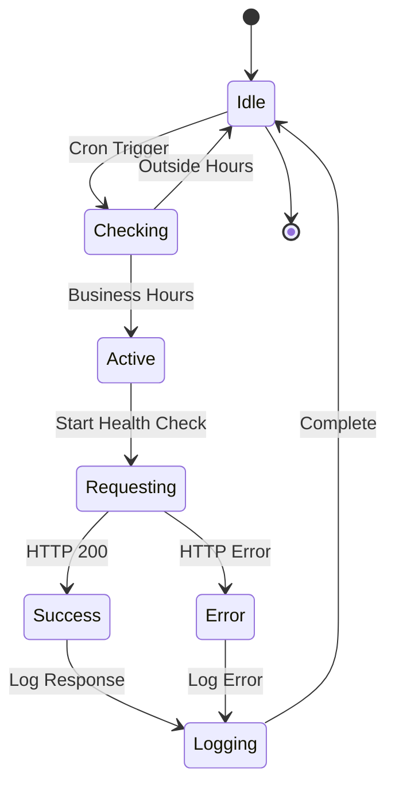

### Deployment Architecture

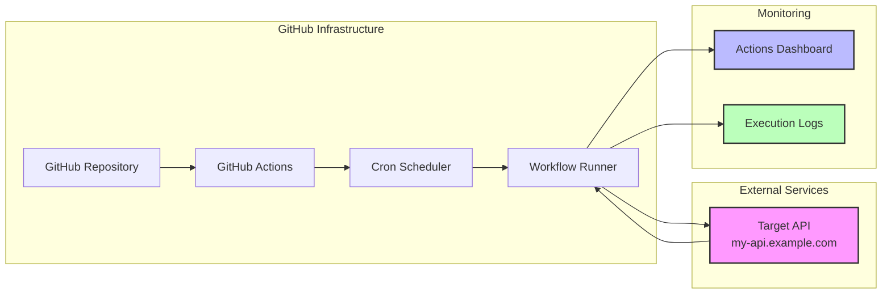

### Automatic Execution

The workflow runs automatically according to the configured schedule. No manual intervention required during normal operation.

### Manual Execution

For testing or ad-hoc verification:

1. Navigate to the **Actions** tab in your GitHub repository
2. Select the **Insomniac API** workflow
3. Click **Run workflow**
4. Choose the branch and click **Run workflow**

## 🛠️ Technical Details

### Workflow Components

- **Trigger**: Scheduled cron job
- **Runner**: GitHub-hosted runner
- **Steps**: HTTP request execution, response validation, logging
- **Retry Logic**: Configurable retry mechanism for failed requests

### Requirements

- GitHub repository with Actions enabled
- API endpoint accessible from GitHub Actions runners
- Appropriate permissions for workflow execution

## 📝 Setup Instructions

### Setup Process Flow

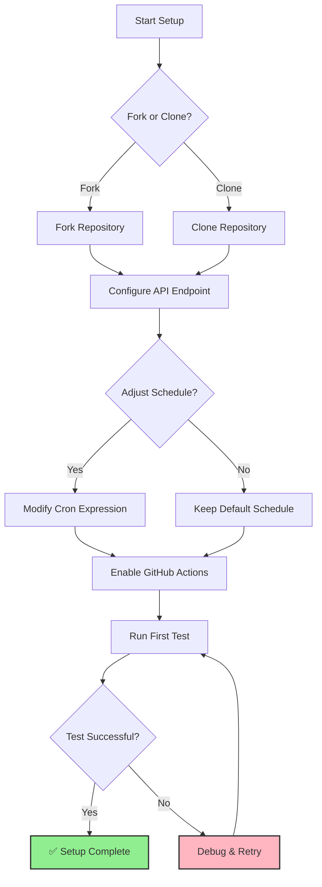

1. **Fork or clone this repository**
2. **Configure the API endpoint** in the workflow file
3. **Adjust the schedule** if needed (modify cron expression)
4. **Enable GitHub Actions** in repository settings
5. **Monitor initial executions** in the Actions tab

## 🔐 Security Considerations

### Security Flow

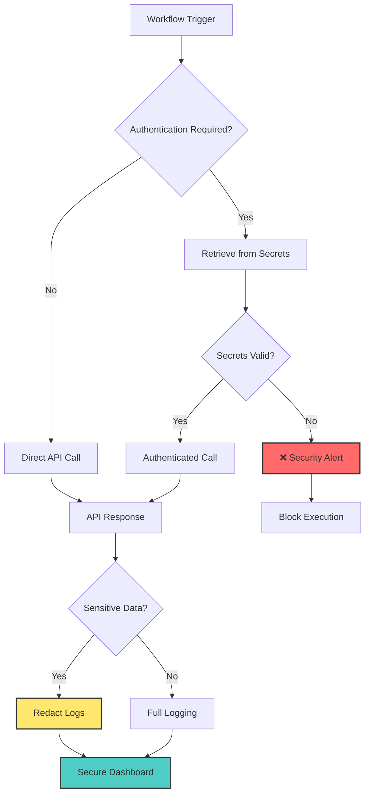

### Error Handling Flow

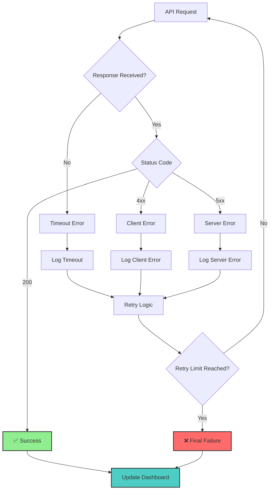

- API endpoints should be publicly accessible or authenticated via secrets
- Sensitive data (API keys, tokens) should be stored in GitHub Secrets
- Workflow logs may contain sensitive information - configure accordingly
- Consider rate limiting on the API endpoint

## 🤝 Contributing

Contributions are welcome! Please feel free to submit issues or pull requests.

## 📄 License

This project is licensed under the MIT License.

## 📞 Support

### Issue Resolution Flow

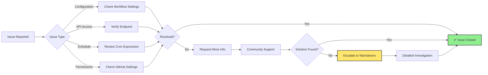

### System Health Overview

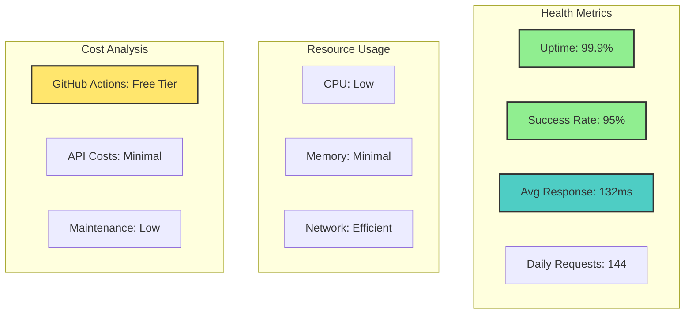

For issues or questions:
- Open an issue in the GitHub repository
- Check the Actions tab for execution logs
- Review the workflow configuration

---

**Note**: This is a preventive maintenance tool. Ensure your API has proper monitoring and alerting beyond this simple health check mechanism.
